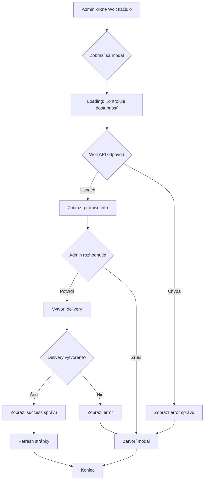

# 🎨 Wolt Modal - Vizuálny Návrh pre Admin Panel

## 📱 Ako to bude vyzerať

### 1. Počiatočný stav - Tlačidlo v OrderCard

```
┌─────────────────────────────────────────────────────────┐
│ #1234 | PAID ✅ | Ján Novák | +421912345678            │
│                                                          │
│ [✅ Potvrdiť] [❌ Odmietnuť] [📦 Storyous] [🚚 Wolt]   │
└─────────────────────────────────────────────────────────┘
```

### 2. Po kliknutí na "🚚 Wolt" - Loading stav

```
┌─────────────────────────────────────────────────────────┐
│ #1234 | PAID ✅ | Ján Novák | +421912345678            │
│                                                          │
│ [✅ Potvrdiť] [❌ Odmietnuť] [📦 Storyous] [⏳ ...]     │
│                                                          │
│ 💬 Kontroluje dostupnosť Wolt...                        │
└─────────────────────────────────────────────────────────┘
```

### 3. Modal s potvrdením (ak je Wolt dostupný)

```
┌─────────────────────────────────────────────────────────┐
│                                                          │
│  ╔═══════════════════════════════════════════════════╗  │
│  ║  🚚 Potvrdiť Wolt doručenie?                     ║  │
│  ╠═══════════════════════════════════════════════════╣  │
│  ║                                                   ║  │
│  ║  📦 Objednávka: #1234                            ║  │
│  ║  👤 Zákazník: Ján Novák                          ║  │
│  ║                                                   ║  │
│  ║  ─────────────────────────────────────────────   ║  │
│  ║                                                   ║  │
│  ║  💰 Poplatok za doručenie: 2.50€                 ║  │
│  ║  ⏱️  Odhadovaný čas: ~35 minút                   ║  │
│  ║                                                   ║  │
│  ║  📍 Adresa doručenia:                             ║  │
│  ║     Hlavná 1                                     ║  │
│  ║     81101 Bratislava                             ║  │
│  ║                                                   ║  │
│  ║  ─────────────────────────────────────────────   ║  │
│  ║                                                   ║  │
│  ║  [❌ Zrušiť]              [✅ Potvrdiť]          ║  │
│  ╚═══════════════════════════════════════════════════╝  │
│                                                          │
└─────────────────────────────────────────────────────────┘
```

### 4. Error stav - Wolt nie je dostupný

```
┌─────────────────────────────────────────────────────────┐
│  ╔═══════════════════════════════════════════════════╗  │
│  ║  ❌ Wolt nie je dostupný                         ║  │
│  ╠═══════════════════════════════════════════════════╣  │
│  ║                                                   ║  │
│  ║  Dôvod: Mimo doručovacej zóny                     ║  │
│  ║                                                   ║  │
│  ║  📍 Adresa: Hlavná 1, 81101 Bratislava           ║  │
│  ║                                                   ║  │
│  ║  💡 Tip: Skontrolujte, či je adresa v rámci      ║  │
│  ║     doručovacej zóny Wolt.                        ║  │
│  ║                                                   ║  │
│  ║              [✅ Zavrieť]                         ║  │
│  ╚═══════════════════════════════════════════════════╝  │
└─────────────────────────────────────────────────────────┘
```

### 5. Úspešné vytvorenie

```
┌─────────────────────────────────────────────────────────┐
│ #1234 | PREPARING 🍕 | Ján Novák | +421912345678        │
│                                                          │
│ [✅ Potvrdiť] [❌ Odmietnuť] [📦 Storyous] [🚚 Wolt ✅] │
│                                                          │
│ 💬 ✅ Wolt doručenie vytvorené!                         │
│ 🔗 Tracking: https://wolt.com/track/abc123              │
└─────────────────────────────────────────────────────────┘
```

---

## 💻 Konkrétny Kód - Komponent

### WoltConfirmationModal.tsx

```tsx
'use client';

import { Order } from '@pizza-ecosystem/shared';

interface WoltPromise {
  promiseId: string;
  feeCents: number;
  etaMinutes: number;
  validUntil: string;
}

interface WoltConfirmationModalProps {
  isOpen: boolean;
  order: Order;
  promise: WoltPromise | null;
  isLoading: boolean;
  error: string | null;
  onConfirm: () => void;
  onCancel: () => void;
}

export function WoltConfirmationModal({
  isOpen,
  order,
  promise,
  isLoading,
  error,
  onConfirm,
  onCancel,
}: WoltConfirmationModalProps) {
  if (!isOpen) return null;

  const customer = order.customer as any;
  const address = order.address as any;

  return (
    <div className="fixed inset-0 bg-black bg-opacity-50 flex items-center justify-center z-50 p-4">
      <div className="bg-white rounded-lg shadow-xl max-w-md w-full">
        {/* Header */}
        <div className="px-6 py-4 border-b border-gray-200">
          <h2 className="text-xl font-bold text-gray-900 flex items-center gap-2">
            {error ? '❌ Wolt nie je dostupný' : '🚚 Potvrdiť Wolt doručenie?'}
          </h2>
        </div>

        {/* Content */}
        <div className="px-6 py-4">
          {isLoading && (
            <div className="text-center py-8">
              <div className="animate-spin rounded-full h-12 w-12 border-b-2 border-orange-600 mx-auto mb-4"></div>
              <p className="text-gray-600">Kontroluje dostupnosť Wolt...</p>
            </div>
          )}

          {error && (
            <div className="space-y-4">
              <div className="bg-red-50 border border-red-200 rounded-lg p-4">
                <p className="text-red-800 font-semibold mb-2">Dôvod:</p>
                <p className="text-red-700">{error}</p>
              </div>
              
              <div className="bg-gray-50 rounded-lg p-4">
                <p className="text-sm text-gray-600 mb-1">📍 Adresa:</p>
                <p className="text-gray-900 font-medium">
                  {address.street}, {address.postalCode} {address.city}
                </p>
              </div>

              <div className="bg-blue-50 border border-blue-200 rounded-lg p-3">
                <p className="text-sm text-blue-800">
                  💡 <strong>Tip:</strong> Skontrolujte, či je adresa v rámci doručovacej zóny Wolt.
                </p>
              </div>
            </div>
          )}

          {promise && !error && (
            <div className="space-y-4">
              {/* Order Info */}
              <div className="bg-gray-50 rounded-lg p-4">
                <div className="flex justify-between items-center mb-2">
                  <span className="text-sm text-gray-600">📦 Objednávka:</span>
                  <span className="font-mono font-semibold text-gray-900">
                    #{order.orderNumber?.toString().padStart(4, '0') || order.id.slice(0, 8).toUpperCase()}
                  </span>
                </div>
                <div className="flex justify-between items-center">
                  <span className="text-sm text-gray-600">👤 Zákazník:</span>
                  <span className="font-semibold text-gray-900">{customer.name}</span>
                </div>
              </div>

              <div className="border-t border-gray-200 my-4"></div>

              {/* Delivery Info */}
              <div className="space-y-3">
                <div className="flex justify-between items-center">
                  <span className="text-gray-600">💰 Poplatok za doručenie:</span>
                  <span className="text-xl font-bold text-orange-600">
                    €{(promise.feeCents / 100).toFixed(2)}
                  </span>
                </div>
                
                <div className="flex justify-between items-center">
                  <span className="text-gray-600">⏱️ Odhadovaný čas:</span>
                  <span className="text-lg font-semibold text-gray-900">
                    ~{promise.etaMinutes} minút
                  </span>
                </div>
              </div>

              <div className="border-t border-gray-200 my-4"></div>

              {/* Address */}
              <div className="bg-gray-50 rounded-lg p-4">
                <p className="text-sm text-gray-600 mb-2">📍 Adresa doručenia:</p>
                <p className="text-gray-900 font-medium">
                  {address.street}
                </p>
                <p className="text-gray-700">
                  {address.postalCode} {address.city}
                </p>
                {address.instructions && (
                  <p className="text-sm text-gray-500 mt-2">
                    💬 {address.instructions}
                  </p>
                )}
              </div>
            </div>
          )}
        </div>

        {/* Footer */}
        <div className="px-6 py-4 border-t border-gray-200 flex gap-3 justify-end">
          <button
            onClick={onCancel}
            disabled={isLoading}
            className="px-4 py-2 bg-gray-200 text-gray-700 rounded-lg hover:bg-gray-300 font-semibold disabled:opacity-50 disabled:cursor-not-allowed"
          >
            {error ? 'Zavrieť' : 'Zrušiť'}
          </button>
          
          {!error && promise && (
            <button
              onClick={onConfirm}
              disabled={isLoading}
              className="px-4 py-2 bg-orange-600 text-white rounded-lg hover:bg-orange-700 font-semibold disabled:opacity-50 disabled:cursor-not-allowed flex items-center gap-2"
            >
              {isLoading ? (
                <>
                  <div className="animate-spin rounded-full h-4 w-4 border-b-2 border-white"></div>
                  Vytvára sa...
                </>
              ) : (
                '✅ Potvrdiť'
              )}
            </button>
          )}
        </div>
      </div>
    </div>
  );
}
```

---

## 🔄 Flow Diagram



---

## 📐 CSS Styling (podľa existujúceho štýlu)

Modal bude používať rovnaký štýl ako ostatné modaly v projekte:

- **Overlay**: `bg-black bg-opacity-50` (polopriehľadné pozadie)
- **Modal**: `bg-white rounded-lg shadow-xl` (biely, zaoblený, so tieňom)
- **Tlačidlá**: 
  - Zrušiť: `bg-gray-200 text-gray-700 hover:bg-gray-300`
  - Potvrdiť: `bg-orange-600 text-white hover:bg-orange-700` (Wolt farba)
- **Z-index**: `z-50` (nad ostatnými elementmi)

---

## 🎯 Integrácia do OrderCard.tsx

```tsx
// V OrderCard komponente:

const [showWoltModal, setShowWoltModal] = useState(false);
const [woltPromise, setWoltPromise] = useState<WoltPromise | null>(null);
const [checkingWolt, setCheckingWolt] = useState(false);
const [woltError, setWoltError] = useState<string | null>(null);

const handleCreateWoltDelivery = async () => {
  setShowWoltModal(true);
  setCheckingWolt(true);
  setWoltError(null);
  setWoltPromise(null);
  
  try {
    const promise = await checkWoltAvailability(order.id);
    setWoltPromise(promise);
  } catch (error: any) {
    setWoltError(error.message || 'Wolt nie je dostupný');
  } finally {
    setCheckingWolt(false);
  }
};

const handleConfirmWoltDelivery = async () => {
  if (!woltPromise) return;
  
  setCreatingWolt(true);
  try {
    const result = await createWoltDelivery(order.id, woltPromise.promiseId);
    if (result.success) {
      setShowWoltModal(false);
      setWoltMessage(`✅ Wolt delivery created! ${result.trackingUrl ? `Tracking: ${result.trackingUrl}` : ''}`);
      setTimeout(() => window.location.reload(), 1500);
    }
  } catch (error: any) {
    setWoltError(error.message || 'Nepodarilo sa vytvoriť doručenie');
  } finally {
    setCreatingWolt(false);
  }
};

// V JSX:
<WoltConfirmationModal
  isOpen={showWoltModal}
  order={order}
  promise={woltPromise}
  isLoading={checkingWolt || creatingWolt}
  error={woltError}
  onConfirm={handleConfirmWoltDelivery}
  onCancel={() => {
    setShowWoltModal(false);
    setWoltPromise(null);
    setWoltError(null);
  }}
/>
```

---

## 📱 Responsive Design

Modal bude responzívny:

- **Mobile**: `max-w-md w-full mx-4` (úzky, s paddingom)
- **Desktop**: `max-w-md` (stredná šírka)
- **Padding**: `p-4` na mobile, `px-6 py-4` vnútri

---

## ✨ Animácie (voliteľné)

Ak chceš pridať animácie (podobne ako v CustomizationModal):

```tsx
import { motion, AnimatePresence } from 'framer-motion';

<AnimatePresence>
  {isOpen && (
    <>
      <motion.div
        initial={{ opacity: 0 }}
        animate={{ opacity: 1 }}
        exit={{ opacity: 0 }}
        className="fixed inset-0 bg-black bg-opacity-50"
      />
      <motion.div
        initial={{ opacity: 0, scale: 0.95, y: 20 }}
        animate={{ opacity: 1, scale: 1, y: 0 }}
        exit={{ opacity: 0, scale: 0.95, y: 20 }}
        className="bg-white rounded-lg..."
      >
        {/* content */}
      </motion.div>
    </>
  )}
</AnimatePresence>
```

---

## 🎨 Farbová schéma

- **Wolt orange**: `bg-orange-600` / `text-orange-600`
- **Success**: `text-green-600`
- **Error**: `text-red-600` / `bg-red-50`
- **Info**: `text-blue-600` / `bg-blue-50`
- **Neutral**: `text-gray-600` / `bg-gray-50`

---

Toto je kompletný návrh. Chceš niečo zmeniť alebo pridať?
